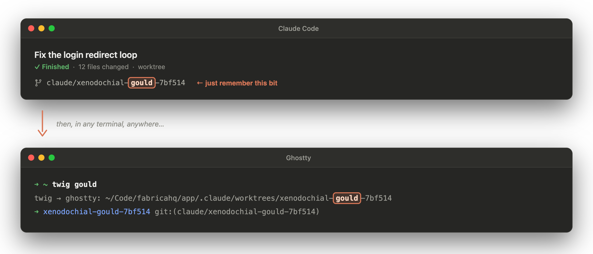

# twig

Git worktrees, one short command away.

```sh
twig gould          # finds claude/xenodochial-gould-7bf514, opens Ghostty there
tw gould            # ...or cd your current shell into it
```

twig is a small CLI that makes it easy to work with the many git worktrees
created by AI coding tools like Claude Code, Codex, and Conductor.

**[Full documentation → joshpadnick.com/twig](https://joshpadnick.com/twig/)**

## How to use it



1. An agent finishes some work. In the Claude Code or Codex UI, glance at
   the session's branch or worktree name and keep any memorable part of
   it. Here that's `gould` out of `claude/xenodochial-gould-7bf514`.
2. In any terminal, type `twig gould`. twig finds where that worktree
   lives on disk, opens a new terminal window there (plus any other
   openers you configured, like Cursor), and runs the repo's setup script
   if it hasn't run yet.
3. By default twig opens a new terminal window. To jump there inside the
   terminal you're already using, run `tw gould` instead; `tw` is the
   small shell function that `twig shell-init` installs. And
   `twig gould --run` also starts the repo's declared dev command after
   setup.
4. Done with that branch? `twig rm gould` asks for confirmation, calling
   out any commits you haven't pushed, then removes the worktree and
   keeps the branch.

## Where worktrees hide

Every tool has its own ideas about where work lives. Claude Code desktop
checks sessions out inside the repo under `.claude/worktrees/`, with
generated names nobody types twice. Conductor keeps workspaces at
`~/conductor/workspaces/<project>/<name>`. Cloud sessions (Claude Code
web, Codex) leave a branch on GitHub and no local directory at all.

twig knows all of these out of the box. The first two are scanned
automatically. For the third, `twig -r <fragment>` searches the remotes of
repos you already have, fetches the branch, and builds the worktree — or
hand twig the PR's GitHub URL (`twig https://github.com/org/app/pull/140`)
and it finds the head branch for you.

## Install

```sh
brew install --cask josh-padnick/tap/twig
# or
go install github.com/josh-padnick/twig@latest
```

Then add the shell function for in-place cd (recommended):

```sh
eval "$(twig shell-init zsh)"     # ~/.zshrc; bash and fish also supported
```

## Quickstart

```sh
twig init              # interactive first-run setup (roots, openers, shell)
twig <fragment>        # open the matching worktree (new Ghostty window)
twig                   # inside a repo: pick among its worktrees
twig -t <fragment>     # enter in the current tab instead
twig -r <fragment>     # also search remote branches (Claude Code web, Codex)
twig <pr-url>          # open a GitHub PR's branch (e.g. .../pull/140)
twig -v <fragment>     # narrate each step and scan location checked
tw <fragment>          # cd in place (via shell-init)
twig list              # everything twig can see, with branch + status
twig rm <fragment>     # remove a worktree (confirms; keeps the branch)
twig doctor            # diagnose config, providers, openers, trust store
```

Commit a `twig.toml` at your repo root and every worktree runs setup on
first entry. Re-entries skip it until the manifest or a watched file
changes:

```toml
[setup]
run = """
bun install
goose up
"""
watch = ["package.json", "bun.lockb", "go.mod"]

[run]
run = "bun dev"        # started by `twig <fragment> --run`
```

## The trust model

Running repo-declared scripts on entry is an attack vector: checking out a
PR branch must never execute attacker code. twig copies direnv's answer.
The first time it sees a given `twig.toml`, it refuses, shows you the
file, and asks for approval (`twig trust`, or an interactive y/N).
Approvals are keyed by path and content hash, so any edit or move re-trips
the gate. An untrusted manifest contributes nothing, not even its `[open]`
opener overrides.
[Details.](https://joshpadnick.com/twig/guides/trust/)

## Openers

Entering a worktree can open more than a terminal:

```toml
# ~/.config/twig/config.toml
[open]
default = ["ghostty", "cursor"]

[open.openers.cursor]
kind = "command"
command = "cursor {{dir}}"
```

The built-in `ghostty` opener drives Ghostty via AppleScript, opening a
new window or, with `-t`, entering the current tab. The `command` kind
covers everything else: editors, browsers, other terminals. Trusted repos
can override the set in their own `twig.toml`.
[Details.](https://joshpadnick.com/twig/guides/openers/)

## Future work

- Clone-from-GitHub when a remote branch's repo isn't on disk at all
  (today, remote pickup needs the repo checked out somewhere under your
  roots).

## Contributing

New openers and providers are small, well-bounded PRs; see the
[contributing guide](https://joshpadnick.com/twig/contributing/openers/).
Run the suite with `go vet ./... && go test ./...`. Tests create real git
repos in temp dirs, with no network and no global git config.

## License

[MIT](LICENSE)
